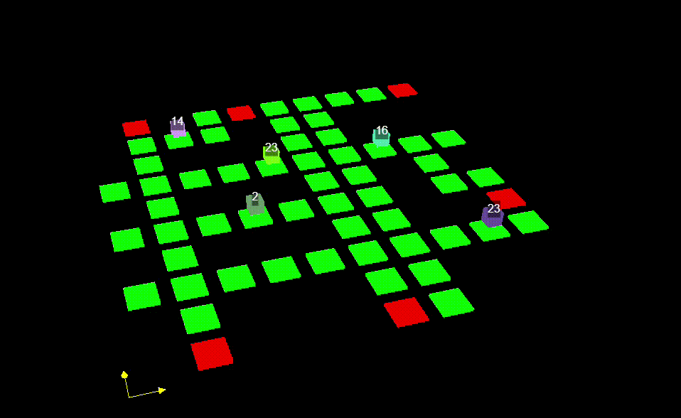
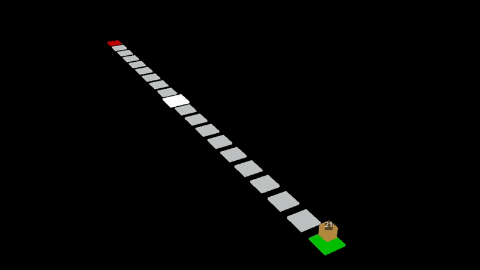

<h1 align="center">DeliverooAgent — Autonomous Software Agents (BDI)</h1> 
    
 
 Project developed for the <b>Autonomous Software Agents</b> course @ University of Trento (A.Y. 2024/2025).  by  <b>Donald Gera</b> 

This repository implements an autonomous agent following the Belief–Desire–Intention (BDI) paradigm.
The agent continuously perceives the environment, updates beliefs, selects goals, and executes plans, adapting online to dynamic conditions.

The environment is based on the Deliveroo.js simulation framework:
https://github.com/unitn-ASA/DeliverooAgent.js

The main objective is to pick up and deliver parcels efficiently, both as:

a single agent (standalone decision-making), and

a multi-agent system (two agents cooperating via communication and coordination).

🎬 Demos
Single Agent

Multi-Agent

✨ Key Features

BDI architecture with modular beliefs, intentions, and plans

Exploration + delivery behavior to balance searching and scoring

Pathfinding utilities for grid navigation

PDDL integration (domain + planner wrapper) for structured action sequences

Multi-agent coordination

handshake/communication

shared information via messages

corridor/handover behavior for narrow passages

Utilities (helpers/constants + banned tiles handling)

🗂️ Project Structure
.
├── README.md
├── ASA_report.pdf
├── agent.js
├── main.js
├── config.js
├── package.json
├── package-lock.json
├── yalc.lock
├── update.sh
├── video_example_agents.gif
├── video_example_multiagents.gif
│
├── BDI - plans/
│   ├── deliver.js
│   ├── explore.js
│   ├── handover.js
│   ├── intention.js
│   ├── pathfinding.js
│   ├── pickup.js
│   └── plan.js
│
├── Beliefs/
│   ├── beliefs.js
│   ├── environment.js
│   └── tile.js
│
├── Collaboration/
│   ├── coordination.js
│   ├── handover_detector.js
│   └── message.js
│
├── PDDL/
│   ├── domain.pddl
│   └── pddl_plan.js
│
└── Utils/
    ├── banlist.js
    └── utils.js

🚀 Installation & Usage
1) Clone the repository
git clone https://github.com/<YOUR_USERNAME>/DeliverooAgent.git
cd DeliverooAgent

2) Install dependencies
npm install

3) Run
node main.js

Change parameters of agent constructor for multiagent and pddl usage

📈 Report

Results and discussion are available in:

ASA_report.pdf
